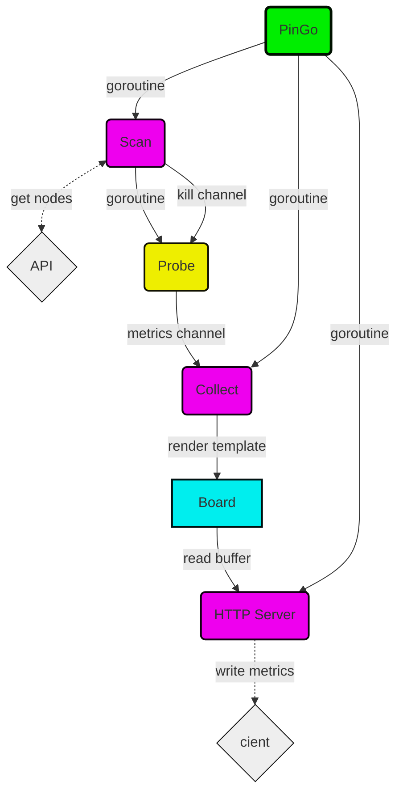

# PinGo


[](https://github.com/basilean/pingo/actions/workflows/codeql.yml)
[](https://github.com/basilean/pingo/actions/workflows/docker-publish.yml)

## Overview
PinGo is a simple application to measure network availability from a source (where it runs) to target nodes (acquired from Kubernetes API).

## How it Works?
It keeps connecting to a Kubernetes API to get a list of nodes with their IP addresses and [Kubelet port](https://kubernetes.io/docs/reference/ports-and-protocols/) (60s default).
For each node, one probe is created and handled, this will loop with an interval (15s default), trying to establish a TCP connection (3 way handshake), measuring reply, time and lost.


Metrics are [Prometheus formatted](https://prometheus.io/docs/instrumenting/exposition_formats/) and published through HTTP in order to be collected by third party monitoring.

## Example
1. Set Kubernetes API Endpoint
```
export PINGO_API=https://KUBERNETES_API:PORT
```
2. Set Authentication Token

:warning: *Service Account must have a bind to a cluster role allowing **get** and **list** over objects **nodes**.*
```
export PINGO_TOKEN=SERVICE_ACCOUNT_TOKEN
```
3. Set API Certificate Authority as Base64
```
export PINGO_CA=BASE64_KUBERNETES_API_CERTIFICATE
```
:information_source: *To get API certificate use this command after replace KUBERNETES_API:PORT.*
```
export PINGO_CA=`echo "" | openssl s_client -connect KUBERNETES_API:PORT -prexit 2>/dev/null | sed -n -e '/BEGIN\ CERTIFICATE/,/END\ CERTIFICATE/ p' | base64 -w0`
```
4. Run the Application
```
./pingo
```

## Build
No external dependencies, just builtin Go libraries.
```
CGO_ENABLED=0 go build -o pingo pingo.go
```

## History
I wrote this software in order to uncover a suspected network issue between two Kubernetes clusters sharing a cache.
