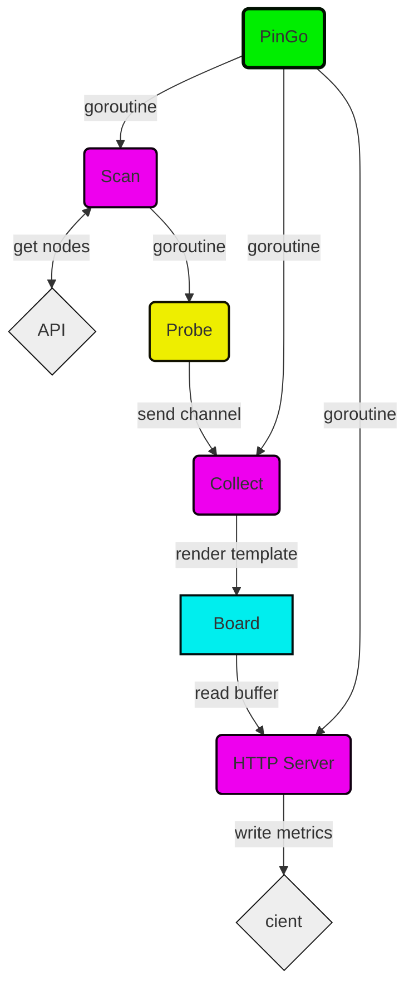

# PinGo
GNU/GPL v3

## Overview
PinGo is simple application to measure network availability from a source (where it runs) to targets nodes (acquired from Kubernetes cluster).

## How it Works?
It connects to a Kubernetes API in order to get a list of nodes with their IP addresses and Kubelet ports.
For each node, one probe is created that will loop with an interval, trying to establish a TCP connection, measuring replies, time and lost packages.


Metrics are Prometheus formatted and exported through HTTP in order to be collected by third party monitoring.

## Example
```
export PINGO_API=https://KUBERNETES_API:PORT
export PINGO_TOKEN=SERVICE_ACCOUNT_TOKEN
./pingo
```

## Build
No external dependencies, just builtin Go libraries.
```
go build -o pingo pingo.go
```

## History
I wrote this software in order to uncover a suspected network issue between two Kubernetes clusters sharing a cache.
